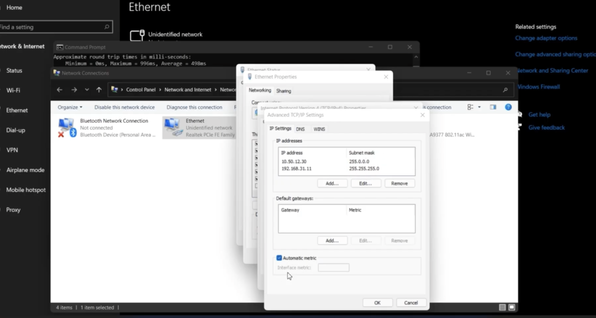

# IT Support Network Troubleshooting – Home Lab

## Overview
This repository documents a basic IT support troubleshooting scenario completed as part of a home networking lab.  
The focus is on endpoint network diagnostics, configuration checks, and resolution documentation, similar to a closed service desk ticket.

---

## Environment
- Device: Windows laptop
- Network: Home Wi-Fi
- Router: Standard wireless router
- Switch: 4-port / 8-port unmanaged switch
- Network Device: IP camera (same troubleshooting approach applies to printers)

---

## Issue Summary
The laptop was unable to connect to the Wi-Fi network during lab testing.

---

## Symptoms
- No internet connectivity
- Network connection failed despite Wi-Fi being enabled
- Other devices connected successfully

---

## Troubleshooting Steps
1. Checked IPv4 network adapter settings  
   - Verified IP configuration
   - Set IPv4 properties to **Obtain an IP address automatically (DHCP)**

2. Checked system date and time settings  
   - Incorrect system time identified
   - Corrected date, time, and time zone settings

3. Retested network connectivity after changes

---

## Resolution
Correcting the IPv4 configuration and system date/time settings restored network connectivity.

---

## Outcome
- Laptop successfully connected to Wi-Fi
- Internet access confirmed
- No further issues observed

---

## Screenshots
- IPv4 Configuration  
  

- Date and Time Configuration  
  

- Connectivity Confirmation  
  

---

## Notes
This exercise reflects common first-level IT support checks performed before escalation, including endpoint configuration validation and basic network diagnostics.
